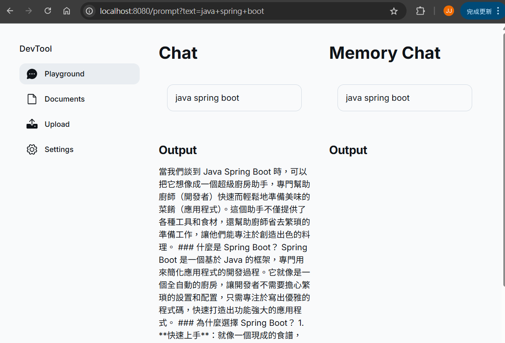
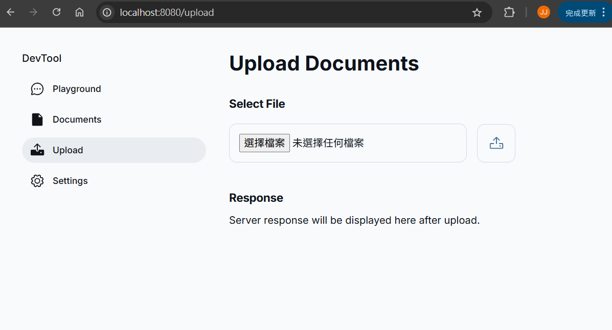
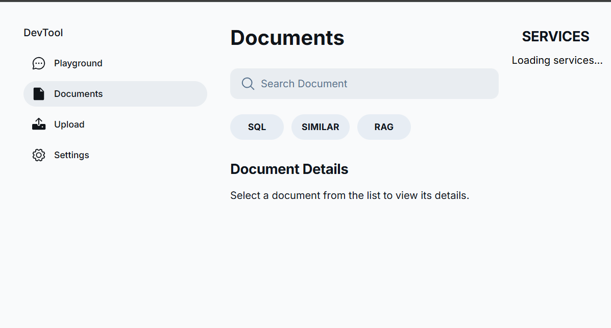

# springai-demo
## Spring AI with pgvector
- java.version: 24
- spring-boot: 3.5.0
- spring-ai.version: 1.0.0-M7
- model: openai
```xml
<dependency>
    <groupId>org.springframework.ai</groupId>
    <artifactId>spring-ai-starter-model-openai</artifactId>
</dependency>
```

### application.yml
model api key
```yaml
spring:
  ai:
    openai:
      api-key: {YOUR_API_KEY}
```
pgvector
```yaml
    vectorstore:
      pgvector:
      index-type: HNSW
      distance-type: COSINE_DISTANCE
      dimensions: 1536
      max-document-batch-size: 10000
```
### vector store table
```sql
-- 啟用 pgvector extension（針對單一database啟用一次即可）
CREATE EXTENSION IF NOT EXISTS vector;
CREATE EXTENSION IF NOT EXISTS hstore;
CREATE EXTENSION IF NOT EXISTS "uuid-ossp";

CREATE TABLE IF NOT EXISTS vector_store (
    id uuid DEFAULT uuid_generate_v4() PRIMARY KEY,
    content text,
    metadata json,
    embedding vector(1536)
    );

-- 建立 HNSW 向量索引 (快速相似查詢)
CREATE INDEX idx_embedding ON vector_store USING HNSW (embedding vector_cosine_ops);

```

## Demo

測試 AI 在「一般聊天」與「記憶聊天」模式下的不同回應方式！🚀
1. **`/prompt` (一般聊天)**
    - 使用 `PromptTemplate` 生成提示，向 AI 查詢特定主題的介紹。
    - 每次請求都是獨立的，不會記住先前的對話內容。

2. **`/chat/{chatId}` (記憶型聊天)**
    - 使用 `chatMemory` 來維持對話上下文，允許 AI 記住過往的訊息。
    - `chatId` 用於識別不同的對話記錄，每次查詢都包含前 n 條訊息，讓 AI 生成連貫的回應。
    - 適用於需要上下文記憶的聊天場景，例如持續性討論或客製化對話。




測試 API 處理檔案上傳並將內容進行向量化處理，適用於 AI 相關的知識檢索或文件分析應用！🚀
1. **檔案上傳處理**
   - 使用 `MultipartFile` 接收上傳的檔案。
   - 透過 `InputStreamResource` 建立檔案流，確保能正確讀取檔案內容。

2. **文件解析**
   - 利用 `TikaDocumentReader` 來解析檔案內容並轉換為 `Document` 物件。

3. **文字分割**
   - 使用 `tokenTextSplitter` 進一步分割 `Document` 內容，使其更適合向量化處理。

4. **向量存儲**
   - 最終將分割後的 `documents` 存入 `vectorStore`，讓 AI 之後能進行高效的向量搜索。

